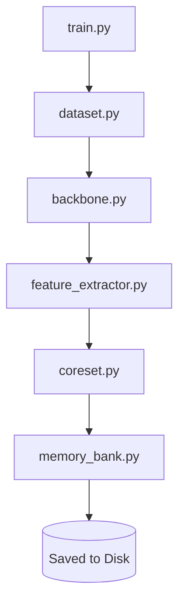
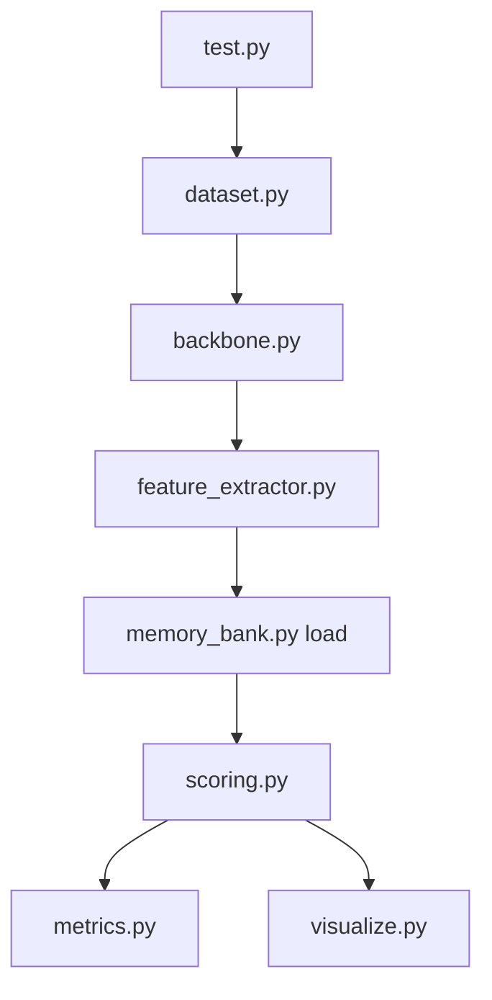

# Defect Detector - PatchCore Implementation

This repository contains an implementation of PatchCore for defect detection.

## Architecture

```text
patchcore_project/
│
├── data/
│   └── dataset.py
│
├── models/
│   └── backbone.py
│
├── core/
│   ├── feature_extractor.py
│   ├── coreset.py
│   ├── memory_bank.py
│   └── scoring.py
│
├── evaluation/
│   ├── metrics.py
│   └── visualize.py
│
├── baseline/
│   └── clip_baseline.py
│
├── config.py
├── train.py
└── test.py
```

## File Responsibilities

| File | Single Responsibility |
| :--- | :--- |
| `data/dataset.py` | Load MVTec folder structure, return DataLoaders |
| `models/backbone.py` | Load frozen WideResNet50, register layer2+layer3 hooks |
| `core/feature_extractor.py` | Forward pass, patch aggregation, return (N, D) tensor |
| `core/coreset.py` | Greedy k-center, return subsampled indices |
| `core/memory_bank.py` | Save/load coreset to disk as .pt |
| `core/scoring.py` | faiss index, NN search, re-weighting, heatmap generation |
| `evaluation/metrics.py` | Image AUROC, Pixel AUROC |
| `evaluation/visualize.py` | Heatmap overlays, results grid |
| `baseline/clip_baseline.py` | CLIP text+image encoding, zero-shot scoring |
| `config.py` | Every hyperparameter in one place, nothing hardcoded |
| `train.py` | Orchestrates memory bank building |
| `test.py` | Orchestrates inference and evaluation |

## Data Flow

### Training


### Testing

