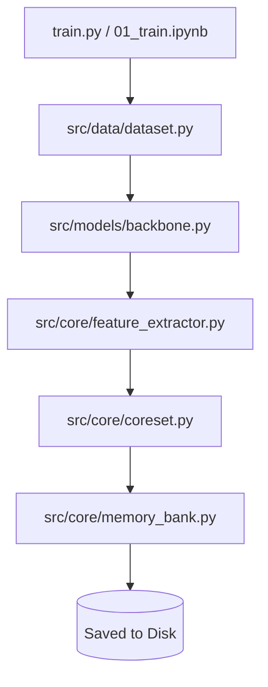
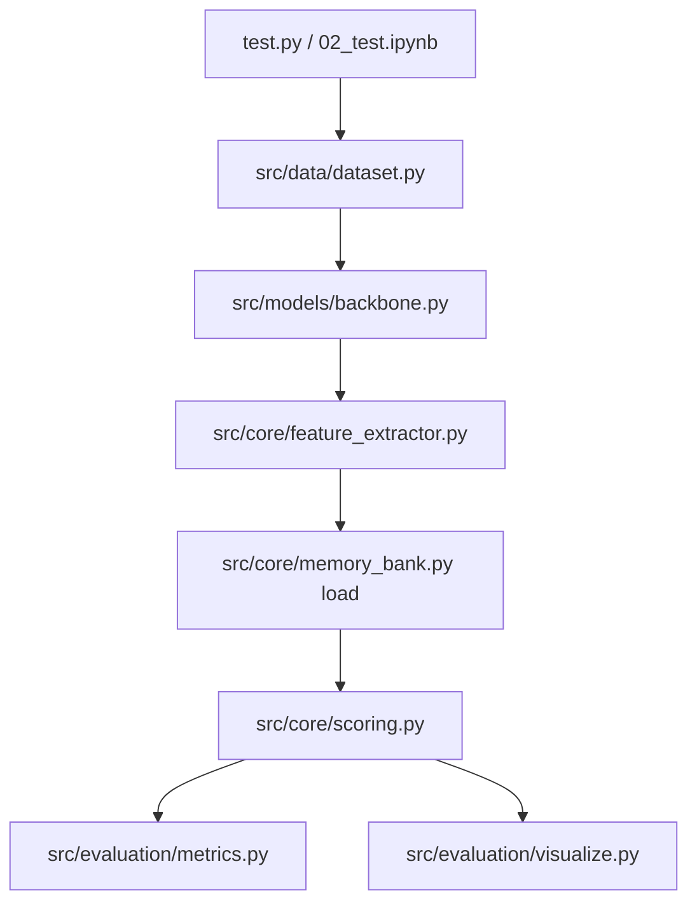

# Defect Detector - PatchCore Implementation

This repository contains an implementation of the **PatchCore** algorithm for industrial anomaly detection using the MVTec AD dataset. The project uses a pre-trained WideResNet50 model to extract features from "good" images, build a memory bank, and detect anomalies using k-Nearest Neighbors search.

---

## 🏗️ Architecture

The codebase is organized into a dual-workflow architecture. You can either run the code locally using the modular Python scripts in `src/`, or you can run it on the cloud using the all-in-one Jupyter notebooks.

```text
Defect_Detector/
│
├── src/
│   ├── data/                 # Data loading and preprocessing
│   ├── models/               # Pre-trained WideResNet50 backbone & hooks
│   ├── core/                 # Feature extraction, coreset subsampling, scoring
│   ├── evaluation/           # AUROC/PRO metrics and heatmap visualization
│   └── baseline/             # Baseline algorithms (e.g. CLIP zero-shot)
│
├── notebooks/
│   ├── 01_train.ipynb        # All-in-one Cloud Training Pipeline
│   ├── 02_test.ipynb         # All-in-one Cloud Testing & Evaluation Pipeline
│   └── 03_inference.ipynb    # Inference testing for real-life images
│
├── outputs/
│   ├── memory_banks/         # Saved .pt feature databases
│   ├── heatmaps/             # Generated visualization PNGs
│   └── patchcore_results.json# Final evaluation metrics
│
├── config.py                 # Global configurations and paths
├── train.py                  # Local modular training script
├── test.py                   # Local modular testing script
├── inference.py              # Local CLI script for testing real photos
├── PROJECT_DOCUMENTATION.txt # Detailed scientific explanation of the project
├── requirements.txt
└── README.md
```

---

## 🚀 How to Run the Project

### Option A: Running on the Cloud (Google Colab) - *Recommended*
If you are running on a cloud environment or don't want to configure local GPU drivers, use the **Notebooks**. 
The notebooks contain the exact same code as the python scripts, but are merged into a single file for easy cloud execution.
1. Upload `notebooks/01_train.ipynb` to Google Colab and click **Run All** to build the memory banks.
2. Upload `notebooks/02_test.ipynb` to Google Colab and click **Run All** to evaluate the model and generate heatmaps.

### Option B: Running Locally (Modular Architecture)
The local `.py` scripts (`train.py`, `test.py`) are strictly equivalent to the notebooks, but they pull logic cleanly from the `src/` directory.

**1. Install Dependencies:**
```bash
pip install -r requirements.txt
```

**2. Train the Model (Build Memory Banks):**
```bash
python train.py
```
*(This executes the same feature extraction and coreset sampling pipeline as `01_train.ipynb`)*

**3. Test the Model (Evaluate Metrics):**
```bash
python test.py
```
*(This executes the same FAISS scoring and evaluation pipeline as `02_test.ipynb`)*

**4. Real-life Inference (Test a single photo):**
```bash
python inference.py path/to/your/photo.jpg bottle
```

---

## 📊 Results

The model was evaluated on the MVTec AD dataset. PatchCore achieved near-perfect anomaly detection performance by comparing test patches against the 1% coreset memory bank.

| Category | Image AUROC | Pixel AUROC | PRO |
| :--- | :--- | :--- | :--- |
| **bottle** | 1.0000 | 0.9846 | 0.9318 |
| **carpet** | 0.9892 | 0.9882 | 0.8663 |
| **screw** | 0.8791 | 0.9292 | 0.6598 |
| **AVERAGE** | **0.9561** | **0.9673** | **0.8193** |

---

## ⚙️ Data Flow

### Training Pipeline


### Testing Pipeline


---

## 📚 Deep Dive Documentation

For a comprehensive, 15-section scientific breakdown of how PatchCore works, why Transfer Learning was used, and a mathematical explanation of why these results are legitimate and not overfitting, please read **`PROJECT_DOCUMENTATION.txt`** located in the root of this repository!